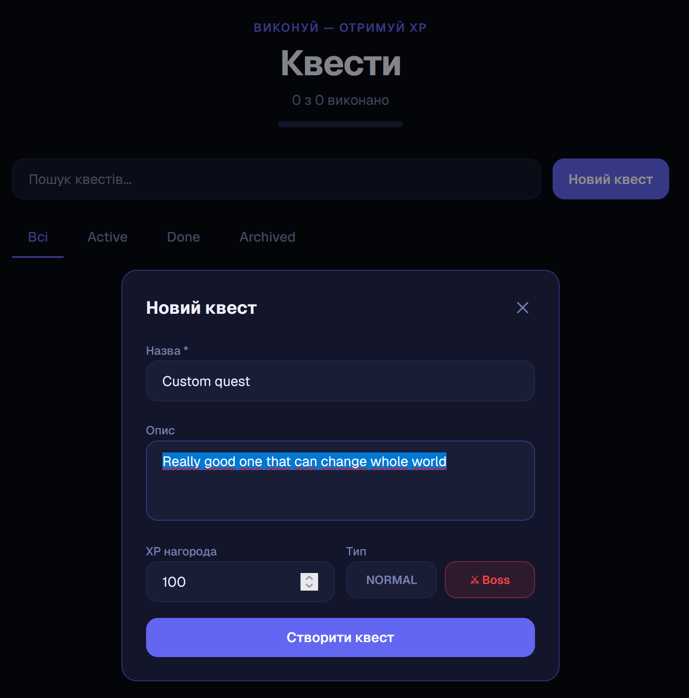
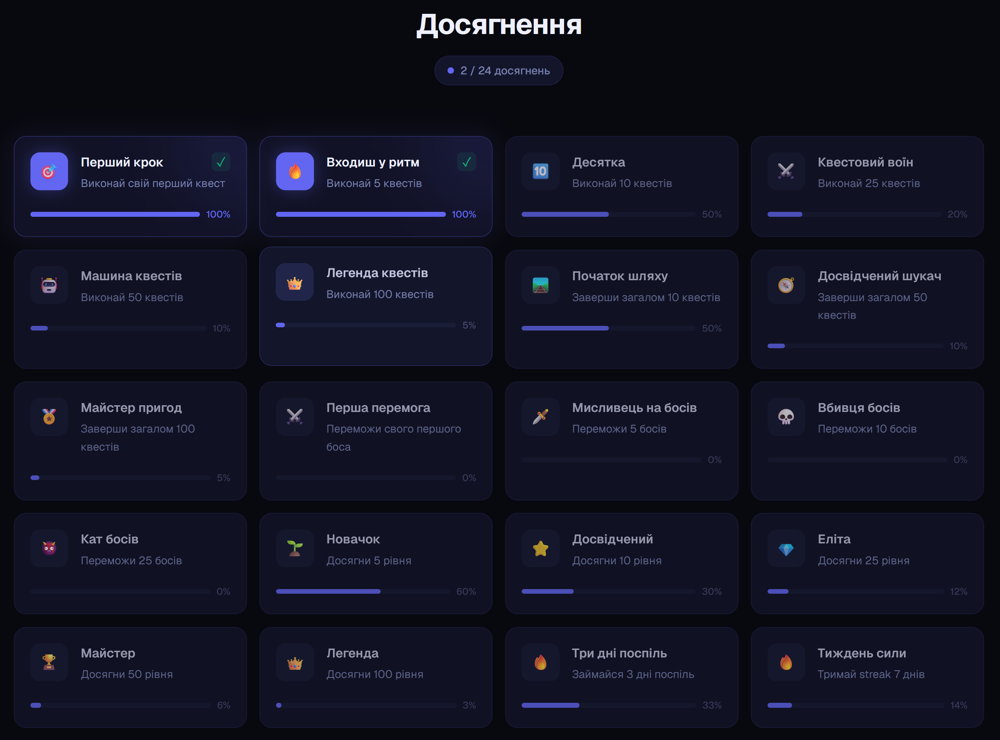

<div align="center">

# ⚔️ DevQuest

### Gamify your developer journey.

A full-stack gamification platform designed to turn everyday development goals into quests, progress, and achievements.

<br />

<a href="https://devquesti.netlify.app">
  
</a>
&nbsp;
<a href="https://github.com/Unstvii/DevQuest">
  
</a>

<br />
<br />


</div>

---

## 📖 Table of Contents

- [About](#-about)
- [Features](#-features)
- [Screenshots](#-screenshots)
- [Tech Stack](#-tech-stack)
- [Architecture](#-architecture)
- [Authentication](#-authentication)
- [Key Engineering Decisions](#-key-engineering-decisions)
- [Project Structure](#-project-structure)
- [Getting Started](#-getting-started)
- [Deployment](#-deployment)
- [Project Status](#-project-status)

---

## 🎯 About

**DevQuest** is a full-stack gamification platform for developers.

Instead of treating learning and development as a simple task list, DevQuest turns goals into **quests** with XP, levels, streaks, achievements, and leaderboards.

The project was built as a portfolio-focused full-stack application with an emphasis on:

- authentication and authorization
- REST API design
- relational data modeling
- secure cookie-based authentication
- frontend state management
- gamification logic
- responsive UI/UX
- deployment of a separated frontend, backend, and database

The goal was to build something more representative of a real-world application than a simple Todo or CRUD project.

---

## ✨ Features

### 🔐 Authentication

- User registration and login
- Access and refresh tokens
- HttpOnly cookies
- Secure cookies in production
- Authentication middleware
- Protected routes
- Automatic access-token refresh
- Logout flow

### ⚔️ Quest System

- Create personal quests
- Assign XP rewards
- Normal and Boss quests
- Update quest status
- Complete quests
- Fail quests
- Archive quests
- User-specific quest access

### 📈 Progression

- XP system
- Level progression
- User statistics
- Quest counters
- Progress tracking

### 🔥 Streaks

- Daily activity streak
- Automatic streak updates
- Consecutive-day progression

### 🏆 Achievements

- System achievements
- Custom achievements
- Automatic achievement checks
- Achievement progress
- Unlock states

### 🥇 Leaderboard

- XP-based ranking
- User progression
- Responsive leaderboard interface

### 🎨 UI / UX

- Responsive design
- Light and dark themes
- Premium SaaS-inspired interface
- Gamification-focused visual feedback
- Progress indicators
- Toast notifications
- Responsive layouts

---

## 🖥️ Screenshots

### Dashboard

<p align="center">
  
</p>

### Quest Management

<p align="center">
  
</p>

### Achievements

<p align="center">
  
</p>

### Leaderboard

<p align="center">
  
</p>

---

## 🛠️ Tech Stack

### Frontend

| Technology          | Purpose                      |
| ------------------- | ---------------------------- |
| **Next.js**         | React framework              |
| **React**           | UI library                   |
| **TypeScript**      | Type safety                  |
| **Tailwind CSS**    | Styling                      |
| **Zustand**         | Client-side state management |
| **Axios**           | HTTP requests                |
| **React Hook Form** | Form management              |
| **Zod**             | Schema validation            |
| **Sonner**          | Toast notifications          |
| **Lucide React**    | Icons                        |

### Backend

| Technology     | Purpose             |
| -------------- | ------------------- |
| **Node.js**    | JavaScript runtime  |
| **Express**    | REST API framework  |
| **TypeScript** | Type safety         |
| **Prisma**     | ORM                 |
| **PostgreSQL** | Relational database |
| **JWT**        | Authentication      |

### Infrastructure

| Service     | Purpose             |
| ----------- | ------------------- |
| **Netlify** | Frontend deployment |
| **Render**  | Backend deployment  |
| **Neon**    | PostgreSQL database |

---

## 🏗️ Architecture

DevQuest is structured as a separated frontend, backend, and database application.

```text
┌──────────────────────────────────────────────┐
│                    Client                    │
│                                              │
│              Next.js / React                 │
│                                              │
└──────────────────────┬───────────────────────┘
                       │
                       │ HTTP / REST
                       ▼
┌──────────────────────────────────────────────┐
│                   Backend                    │
│                                              │
│              Node.js / Express              │
│                                              │
│        Controllers → Services → Prisma       │
│                                              │
└──────────────────────┬───────────────────────┘
                       │
                       │ Prisma
                       ▼
┌──────────────────────────────────────────────┐
│                  Database                    │
│                                              │
│                 PostgreSQL                   │
│                                              │
└──────────────────────────────────────────────┘
```

### Request Flow

```text
User interaction
       │
       ▼
React / Next.js
       │
       ▼
Axios
       │
       ▼
Express API
       │
       ├── Authentication middleware
       │
       ├── Controller
       │
       └── Service
              │
              ▼
           Prisma
              │
              ▼
         PostgreSQL
```

---

## 🔐 Authentication

DevQuest uses **access and refresh tokens stored in HttpOnly cookies**.

The browser automatically sends the cookies with authenticated requests, while JavaScript running in the browser cannot directly access HttpOnly cookies.

```text
┌─────────────┐
│   Browser   │
└──────┬──────┘
       │
       │ HttpOnly + Secure cookies
       ▼
┌─────────────┐
│  Express    │
│ Middleware  │
└──────┬──────┘
       │
       │ authenticate
       ▼
┌─────────────┐
│  req.user   │
│   userId    │
└──────┬──────┘
       │
       ▼
┌─────────────┐
│   Prisma    │
└─────────────┘
```

### Token Flow

```text
Login
  │
  ▼
Validate credentials
  │
  ▼
Generate access + refresh tokens
  │
  ▼
Set HttpOnly + Secure cookies
  │
  ▼
Authenticated requests
  │
  ▼
Access token expires
  │
  ▼
Refresh token flow
  │
  ▼
New access token
```

The frontend uses Axios with credentials enabled so authentication cookies can be included in requests.

---

## 🧠 Key Engineering Decisions

### 1. HttpOnly Authentication Cookies

Authentication tokens are stored in **HttpOnly cookies** instead of `localStorage`.

This prevents client-side JavaScript from directly reading the tokens and keeps authentication credentials outside normal browser JavaScript access.

---

### 2. User-Specific Resource Access

Quest resources are associated with the authenticated user.

The API obtains the user's ID from the authenticated request instead of trusting a user ID supplied by the client.

Conceptually:

```text
Authenticated user
        +
    Quest ID
        │
        ▼
Check quest ownership
        │
        ├── Allowed
        │
        └── Not found / denied
```

This prevents a user from accessing another user's quest simply by knowing its ID.

---

### 3. Authentication and Authorization

Authentication answers:

> Who is the user?

Authorization answers:

> Is this user allowed to access this resource?

The request flow is:

```text
JWT
 ↓
Authentication middleware
 ↓
req.user.id
 ↓
Resource ownership check
 ↓
Allowed / denied
```

---

### 4. Server-Side Gamification Logic

Important progression logic is handled on the backend instead of trusting client-provided values.

Quest completion can trigger multiple related operations:

```text
Complete Quest
      │
      ├── Update quest
      ├── Add XP
      ├── Update streak
      ├── Update statistics
      ├── Check achievements
      └── Update counters
```

This keeps important game-state changes under server control.

---

### 5. Transactional Operations

Quest completion may require multiple related database updates.

Where atomicity is required, related operations are grouped into a database transaction so that the database does not end up in an inconsistent intermediate state.

---

### 6. Separation of Frontend and Backend

The application uses a dedicated Next.js frontend and Express REST API.

```text
Next.js
   │
   │ REST API
   ▼
Express
   │
   ▼
Prisma
   │
   ▼
PostgreSQL
```

This separation keeps the frontend and backend responsibilities independent and allows them to be deployed separately.

---

## 📂 Project Structure

```text
DevQuest/
│
├── frontend/
│   │
│   ├── app/
│   ├── components/
│   ├── hooks/
│   ├── services/
│   ├── store/
│   ├── types/
│   └── ...
│
├── backend/
│   │
│   ├── src/
│   │   ├── controllers/
│   │   ├── services/
│   │   ├── middleware/
│   │   ├── routes/
│   │   ├── utils/
│   │   └── prisma/
│   │
│   └── ...
│
├── docs/
│   └── screenshots/
│
├── .gitignore
└── README.md
```

---

## 🚀 Getting Started

### Prerequisites

Make sure you have installed:

- Node.js
- npm
- PostgreSQL database

---

### 1. Clone the repository

```bash
git clone https://github.com/Unstvii/DevQuest.git

cd DevQuest
```

---

### 2. Install dependencies

Install frontend dependencies:

```bash
cd frontend
npm install
```

Install backend dependencies:

```bash
cd ../backend
npm install
```

---

### 3. Configure environment variables

Create the required environment files according to the project's environment configuration.

Example:

```env
DATABASE_URL=your_database_url
FRONTEND_URL=http://localhost:3000

JWT_ACCESS_SECRET=your_access_secret
JWT_REFRESH_SECRET=your_refresh_secret
```

> Use the exact variable names from the project's `.env.example` files.

---

### 4. Generate Prisma Client

From the backend directory:

```bash
npx prisma generate
```

---

### 5. Start the development servers

Start the backend:

```bash
npm run dev
```

Start the frontend in another terminal:

```bash
cd frontend
npm run dev
```

The application should then be available locally.

---

## 🌐 Deployment

DevQuest is deployed as a separated full-stack application.

```text
                    DEVQUEST
                       │
          ┌────────────┴────────────┐
          │                         │
          ▼                         ▼
      Netlify                    Render
      Frontend                   Backend
          │                         │
          └────────────┬────────────┘
                       │
                       ▼
                     Neon
                   PostgreSQL
```

### Production

**Frontend**

https://devquesti.netlify.app

**Backend**

https://devquest-api-izoo.onrender.com

**Database**

PostgreSQL hosted through Neon.

---

## 🎮 Product Concept

DevQuest is built around a simple idea:

> Development becomes easier to maintain when progress is visible and rewarding.

Instead of:

```text
TODO
TODO
TODO
```

the user gets:

```text
⚔️ Quest
   │
   ▼
Complete
   │
   ▼
⚡ XP
   │
   ▼
📈 Level Up
   │
   ▼
🔥 Maintain Streak
   │
   ▼
🏆 Unlock Achievement
   │
   ▼
🥇 Compete on Leaderboard
```

The goal is to make consistent development feel more like progression through a game.

---

## 📌 Project Status

DevQuest is a **completed portfolio project**.

The current version focuses on demonstrating full-stack application development, architecture, authentication, database interaction, and gamification logic.

The project is deployed and available for exploration through the live demo.

---

## 🔮 Future Improvements

Possible future improvements include:

- richer quest categories
- advanced statistics
- additional achievement types
- social features
- improved notifications
- more detailed developer progression analytics
- automated testing coverage
- CI/CD improvements
- additional gamification mechanics

---

<div align="center">

### ⚔️ Build. Complete. Level Up.

**DevQuest — turn development into a quest.**

<br />

<a href="https://devquesti.netlify.app">
  
</a>

</div>
